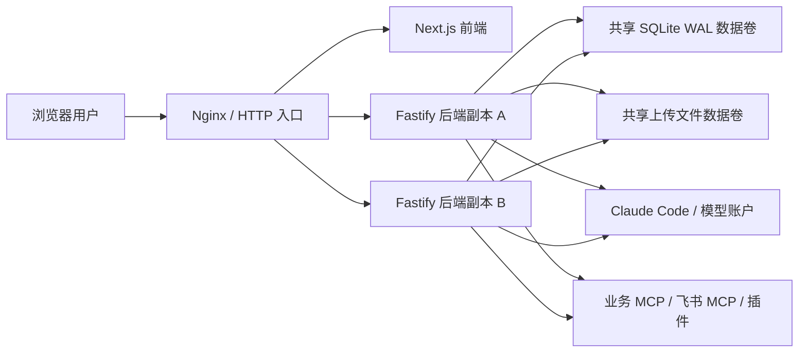
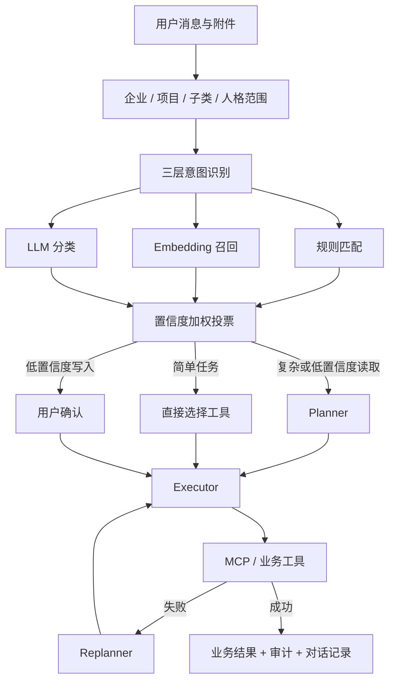
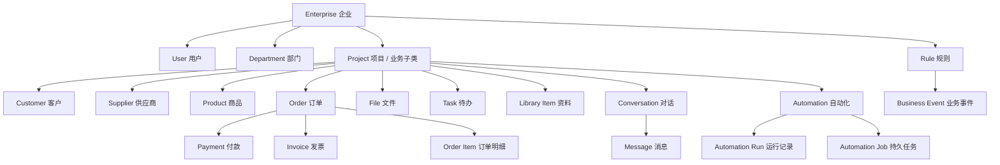

# Enterprise Flow Hub 当前架构与领域模型

> 状态：当前实现基线（2026-07）<br>
> 适用代码：`frontend/`、`backend/`、`shared/`<br>
> 历史截图诊断方案见 [`plan.md`](./plan.md)，它不再代表当前产品边界。

## 1. 当前产品定位

Enterprise Flow Hub 是带业务操作能力的企业 Agent 工作台，而不是单一的截图诊断工具。用户在企业和项目范围内通过对话查询或修改客户、供应商、商品、订单、付款、发票、文件和待办，也可以配置技能、人格、模型、插件、规则及自动化工作流。

核心原则：

1. 企业是租户边界，项目是业务隔离边界。
2. Agent 读取对话选定的企业、项目、子类和人格范围，不跨范围查询或写入。
3. 读取与写入通过显式 MCP/工具执行器完成，业务结果落库并保留审计记录。
4. 自动化、事件和外部集成先持久化，再由带租约的工作进程执行。
5. 数据库不使用物理外键；应用服务维护逻辑关系并在写入时校验。

## 2. 运行时拓扑



当前部署使用单机 Docker Compose。代码支持多个后端进程共享同一个 SQLite WAL 数据库时的任务竞争：短事务认领、唯一去重键、持久化租约、心跳续租和租约过期接管。跨主机多副本应将数据库替换为 PostgreSQL，并将上传目录替换为对象存储；不要把 SQLite 文件放在不保证 POSIX 锁语义的普通网络文件系统上。

## 3. Agent 请求链路



模型配置由一组运行配置组成：Think、Executor、Embedding 各绑定一个独立模型账户；任一时刻只有一个配置处于启用状态。

## 4. 持久化调度与事件机制

### 4.1 定时自动化

1. 每个副本都可以扫描到期自动化。
2. 扫描结果写入 `automation_jobs`；`dedupe_key` 对同一自动化和调度时间槽唯一。
3. 工作进程在 SQLite `IMMEDIATE` 短事务中认领任务，并写入 `lease_owner`、`lease_expires_at`。
4. 执行期间定时续租；`automation_leases` 阻止同一自动化被两个副本并发执行。
5. 成功任务进入 `success`；失败任务指数退避，超过最大次数进入 `dead`。
6. 进程崩溃后，其他副本可认领租约已过期的 `running` 任务。

### 4.2 业务事件

1. API 写操作先将事件写入 `business_events`。
2. 调度器为每个稳定处理器生成 `business_event_deliveries` 投递记录。
3. 每个投递独立认领、续租、重试；全部投递成功后事件才标记为已处理。
4. 规则执行使用 `rule_event_runs(event_id, rule_id)` 记录幂等结果；事件重试时已成功规则不会重复执行。
5. 新创建的规则不会追溯消费规则创建前的历史事件。

### 4.3 外部集成

`integration_runs` 保存请求、幂等键、重试次数、下次执行时间及租约。运行中的副本消失后，过期任务会被另一个副本接管；Webhook 使用指数退避，达到最大次数后保留失败记录供人工检查。

### 4.4 系统维护任务

每日人格记忆压缩等系统任务写入 `maintenance_runs`。主键 `(task_name, schedule_slot)` 防止多副本重复调度，执行同样使用心跳租约和崩溃恢复。

## 5. 领域模型



### 5.1 租户和权限

- `enterprises`：租户根节点和企业标签。
- `users`、`sessions`：登录主体、角色、企业归属和会话。
- `departments`：企业组织树；`parent_id` 是逻辑自关联。
- `projects`：业务隔离单元。界面中的“启航留学”“云杉贸易”等企业下可有多个项目/业务子类。

### 5.2 交易和主数据

- `customers`、`suppliers`、`products`：企业与项目范围内的主数据，支持自定义标签；客户含性别属性。
- `orders`、`order_items`：订单及明细。
- `payments`、`invoices`：回款、开票与到期状态；发票可关联 OCR 来源文件。
- `files`、`library_items`：原始文件与 Agent 可检索资料。
- `tasks`、`approvals`：行动项和审批。

### 5.3 Agent 与执行层

- `conversations`、`messages`：对话、业务范围和执行结果。
- `agent_personas`、`agent_skills`：人格、能力包和长期记忆。
- `model_providers`、`agent_model_configs`：独立模型账户及 Think/Executor/Embedding 组合。
- `ai_tools`、`tool_runs`：工具注册表与执行审计。
- `plugins`、`plugin_configs`：飞书、企微等集成配置。
- `automations`、`automation_runs`、`automation_jobs`、`automation_leases`：工作流定义、业务运行历史、队列和互斥租约。
- `business_events`、`business_event_deliveries`、`rule_event_runs`：事件日志、处理器投递和规则幂等记录。
- `integration_runs`、`maintenance_runs`：外部调用及系统维护任务。

## 6. 一致性边界

- 单条业务记录写入和对应事件写入目前是连续操作，不是同一个数据库事务；关键链路后续可进一步抽象为事务内 Outbox 写入。
- SQLite 多进程依赖同一主机/可靠共享块存储上的 WAL 与文件锁。跨主机生产集群应迁移 PostgreSQL。
- “至少一次”投递可能在进程于外部副作用成功、状态落库前崩溃时重放。内部规则通过 `rule_event_runs` 幂等；外部系统写入必须携带业务幂等键。

## 7. 代码入口

- HTTP 与进程启动：`backend/src/main.ts`
- Agent 编排：`backend/src/agent/architecture.ts`、`backend/src/agent/orchestrated-runtime.ts`
- 自动化队列：`backend/src/automation/scheduler.ts`
- 业务事件：`backend/src/events/emitter.ts`
- 规则执行：`backend/src/rules/executor.ts`
- 外部集成队列：`backend/src/integration/queue.ts`
- 维护任务：`backend/src/maintenance/scheduler.ts`
- 数据库初始化与迁移：`backend/src/db/index.ts`
- 当前 Schema 快照：`backend/src/db/current-schema.sql`

## 8. Docker 镜像定期清理

生产服务器安装 `enterprise-flow-hub-docker-cleanup.timer`，默认每周日 04:10（Asia/Shanghai）执行，并随机错峰最多 20 分钟。每个当前运行镜像仓库仅保留最新 2 个发布版本（当前版和回滚版）；此外清理超过 168 小时且未被容器使用的其他镜像、超过 168 小时的构建缓存和超过 24 小时的停止容器。命名业务数据卷不在清理范围内。

```bash
# 查看下次执行时间
systemctl list-timers enterprise-flow-hub-docker-cleanup.timer --all

# 手动执行
systemctl start enterprise-flow-hub-docker-cleanup.service

# 查看结果
systemctl show enterprise-flow-hub-docker-cleanup.service -p Result -p ExecMainStatus
journalctl -u enterprise-flow-hub-docker-cleanup.service -n 100 --no-pager
```
